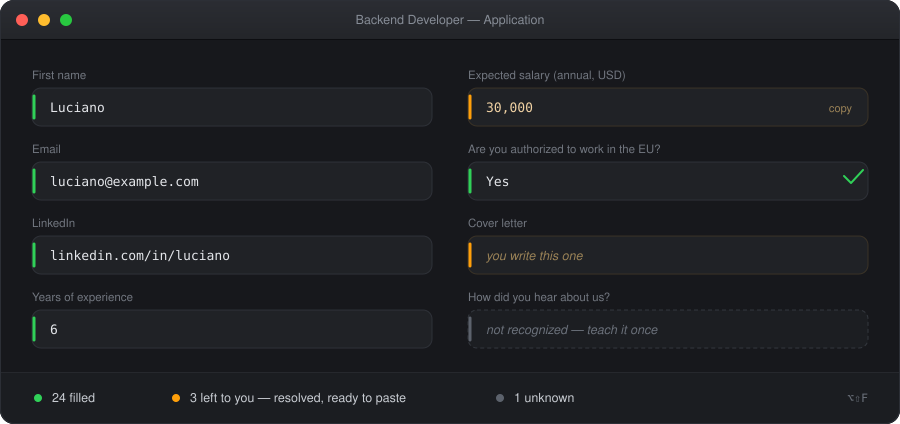
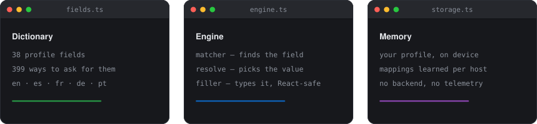
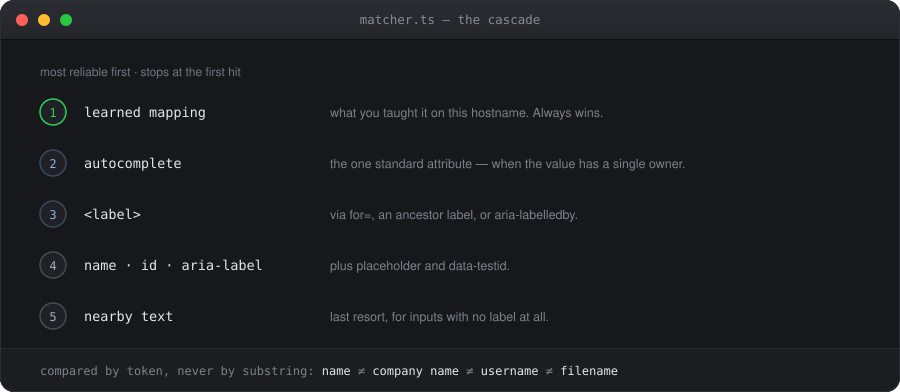
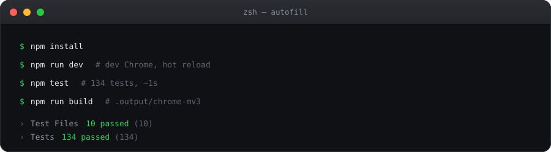

<div align="center">

# Autofill

**A Chrome extension that fills job application forms in one click.**

Every portal asks for the same data under a different name.
This one recognizes them and fills them in. It does **not** apply for you:
it fills, you review, you submit.


<br><br>



</div>

---

## How it works

<div align="center">

</div>

The profile does not store text, it stores **intent**. *I want 2,500 dollars a month*,
*I can work in Argentina and Spain*. Each form asks for something else — an annual figure
in USD, a Yes/No — and the engine translates.

### Why there is no site list

Recruiting portals cannot be enumerated: there are ATS on their own domain, careers pages
hosted on each company's site, and the LinkedIn spin-offs that open when you click *Apply*.
A `host_permissions` list is always short by one.

Instead, the manifest asks for **`activeTab`**: it grants nothing until you open the popup,
and then only for that one tab. The engine is not declared in the manifest; the popup
injects it with `scripting.executeScript` at the moment you fill. Wherever you are, it
works — and the extension cannot read a single tab you did not open yourself with the
button.

### The limit of `activeTab`, and embedded forms

`activeTab` grants the origin of the **main frame**, and nothing else. Embedded ATS —
Greenhouse inside the company's site, or a Wix HTML block, served from another domain —
live in a cross-origin iframe, and the engine does not reach in there: the whole page gets
read and there is not one field to touch.

That is why the manifest also declares `optional_host_permissions`. Nothing is requested at
install time. When the panel detects the form is inside a cross-origin iframe — it asks the
containing frame, which does see it — it offers a button to grant permission **to that
domain**, once. It sticks for next time, and it is revoked from `chrome://extensions` like
any other.

### The cascade

<div align="center">

</div>

Everything is normalized before comparing: `first_name`, `first-name`, `firstName` and
`First Name` are the same thing.

The comparison is **by token, never by substring**. Otherwise `name` matches `company name`,
`username` and `filename`. A multi-word alias counts if it appears as a contiguous sequence;
a single-word alias counts on its own only if it is distinctive (`linkedin` is used by one
field, `name` by four — so that one demands an exact match).

### Language, salary and regions

Three things a free-text field does not solve:

**Language comes from the page.** Detected from `<html lang>` and, as a tie-breaker, by
counting function words. Enumerated fields (availability, English level, work setup) store a
code and render themselves in the right language; free-text fields accept an English
variant, and fall back to Spanish when it is missing.

**Salary converts between periods — never between currencies, never between gross and net.**
It stores amount + currency + period + whether it is gross or net, and the label says what is
being asked: *hourly rate*, *expected annual salary (USD)*, *salario neto mensual*. Going
from month to year is arithmetic; going from dollars to pesos is not, because the exchange
rate moves and in Argentina there are several at once — and going from net to gross is not
either, because tax depends on the country, the bracket and each person's situation. If the
form asks for something that was never entered, it says so instead of inventing a number.

The math goes through the **annual total**, not the monthly one, because the monthly figure
depends on how many payments the year is split into: €30,000 is €2,500 a month over 12
payments and €2,142 over 14. The hourly rate, on the other hand, always comes from twelve
months of work.

**Work authorization is a list of regions.** *Are you authorized to work in the EU?* is not
answered with a sentence, it is answered Yes or No. You store where you can work and the
engine resolves against whichever region the question mentions. Visa sponsorship is derived
from that, inverted: if you can work there, you do not need sponsoring.

### The filling

The most important thing in this project is ten lines in `filler.ts`.

React-controlled inputs **ignore `element.value = x`**: React keeps the last value it wrote,
sees that it matches, and drops the event. The field looks full and the form submits empty.
Greenhouse, Lever and Ashby are all React.

The way out is to call the native prototype setter, which writes without going through the
descriptor React installed on the instance, and only then dispatch `input` and `change`.

For `<select>` and radios, the option whose text is closest to the value wins. If none clears
the threshold nothing is touched, and it gets reported: better empty than the wrong country.

---

## The sensitive fields

Salary (expected and current), work authorization, visa sponsorship, immigration status, ID
number, date of birth, address, cover letter, and the four EEO fields of US forms.

They are not filled automatically. They are highlighted in amber so you fill them by hand. A
wrong salary or a mistaken *I require a visa* burns the application, and those are thought
through case by case.

**But they are still resolved**: the popup shows you the value that belongs in *that* field —
the figure already converted to the period and currency being asked for — with a button to
copy it. There is a setting to fill them automatically, off by default.

---

## Privacy

| Guarantee | What it means |
|---|---|
| **Local only** | Everything lives in `chrome.storage.local`. Nothing leaves the device: no backend, no database, no telemetry. |
| **No `storage.sync`** | Deliberately ruled out: 8KB per item, and this data has no business travelling to Google's servers. |
| **No `<all_urls>`** | Permissions are `activeTab`, `scripting`, `storage`, `unlimitedStorage` (for the CVs) and `downloads` (only for the Export button). Host access is optional and granted per domain, by you, when a form turns out to be embedded. |
| **No real profile in git** | `profile.example.json` holds fictional data and shows the shape of the JSON that Import accepts. |

---

## Development

<div align="center">

</div>

```bash
npm install
npm run dev      # loads the extension in a development Chrome, with hot reload
npm test         # 134 tests over the matcher, resolution, submission and the engine
npm run build    # .output/chrome-mv3
npm run zip      # package for the Chrome Web Store
```

To install it in your everyday Chrome: `npm run build`, then `chrome://extensions` →
Developer mode → Load unpacked → `.output/chrome-mv3`.

### Layout

```
src/
├── core/
│   ├── fields.ts      # the dictionary
│   ├── normalize.ts   # text to canonical form, tokens, similarity
│   ├── context.ts     # page language, and the field's period, currency and region
│   ├── resolve.ts     # from the profile to the exact text this field wants
│   ├── matcher.ts     # the cascade + DOM and shadow DOM traversal
│   ├── filler.ts      # the native setter, selects, radios, highlighting
│   ├── questions.ts   # saved open questions, matched by similarity
│   ├── cvs.ts         # the CV pool and how they get attached
│   ├── audit.ts       # required fields left unanswered
│   ├── frames.ts      # which iframes are out of reach
│   ├── apply.ts       # the submit button, and whether to touch it
│   ├── overlay.ts     # the panel drawn over the page
│   ├── engine.ts      # builds the report, applying the policies
│   └── storage.ts     # profile, learned mappings, export/import
├── entrypoints/
│   ├── autofill.ts    # the script injected into the page
│   ├── background.ts  # service worker
│   └── popup/         # the button, the result and the profile editor
└── types.ts
```

---

## Usage

1. Open the popup, **Profile** tab, fill in your data and save.
2. On an application form, open the popup and click **Fill**.
3. Read the result:
   - **green** — filled
   - **amber** — sensitive, you fill it
   - **gray** — not recognized

The unrecognized ones come with a dropdown to assign them to a profile field. Picking one
saves the mapping for that hostname and fills it right away. **Next time on that site it
already knows** — and since the mapping is stored per frame hostname, what it learned on
`boards.greenhouse.io` works for every company using Greenhouse.

Shortcut: `Alt+Shift+F` opens the popup.

---

## Versioning

The version comes from `package.json` and shows up in `chrome://extensions` and in the popup
header, which is the quick way to tell whether Chrome already picked up the new build. The
history is in [CHANGELOG.md](CHANGELOG.md).

After an `npm run build`, the reload button in `chrome://extensions` is enough — no need to
load the folder again.

## Contributing

PRs welcome, especially **new aliases for the dictionary** and **portals where it does not
work**. See [CONTRIBUTING.md](CONTRIBUTING.md).

The reasoning behind each decision is in [docs/DISENO.md](docs/DISENO.md).

## License

MIT. See [LICENSE](LICENSE).

## Roadmap

- **Per-ATS adapters** for multi-step forms.
- **Custom comboboxes** (Workday, Ashby): inputs that are not a `<select>` but a `<div>` with
  a list that appears as you type. Today the text gets filled but the option is not picked.
- **`MutationObserver`** for fields that show up after a scan.
- **`contenteditable`** support, for the rich-text editors Lever and Ashby use.
- **Grouping by question** instead of by `name`, so a checkbox group is one control and not N.
- **LLM as a fallback** for fields the heuristics miss. That comes later, and only as the last
  step of the cascade.
